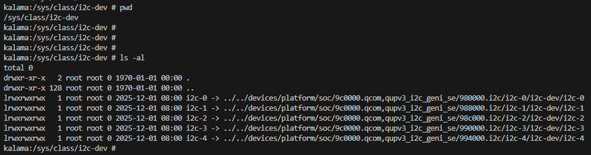

# 80-50445-12
Linux Android Software Technical Overview    

## Kernel 5.15 
Partition Changes   
Compilation and Packaging    

 Dynamically linked kernel module (DLKM)
 

---------------------------------------------------------
# 80-50445-21
The QUPAC_Access file in TZ must be modified to select the required protocol (UART or SPI or I2C) in accordance with the DTSI.

File path: Non-HLOS/TZ.XF.5.24\trustzone_images\core\settings\buses\qup_accesscontrol\qupv3\config\kailua\QUPAC_Access.c

* I2C Master Hub
* Difference between I2C Master Hub and QUPv3 I²C
* Device Tree Configuration - kalama-qupv3.dtsi
```
qupv3_hub_i2c0: i2c@980000
```



---------------------------------------------------------
# SP80-50445-4  QCS8550
**Linux Android Software**
User Guide

The steps to configure, build, and flash the software

## 2.1 Android device folder structure
2.2 Android build commands

== END ==
